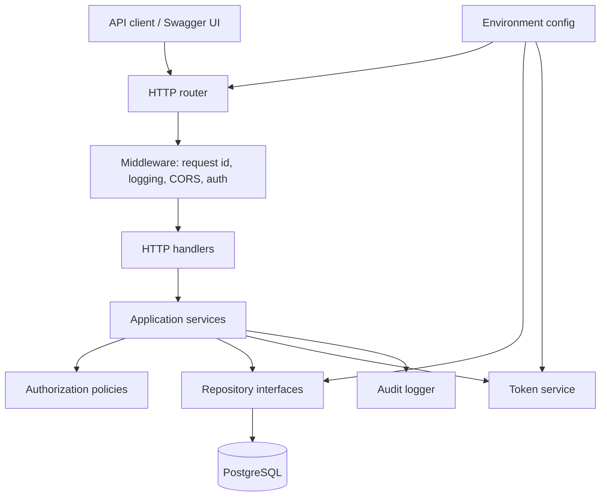
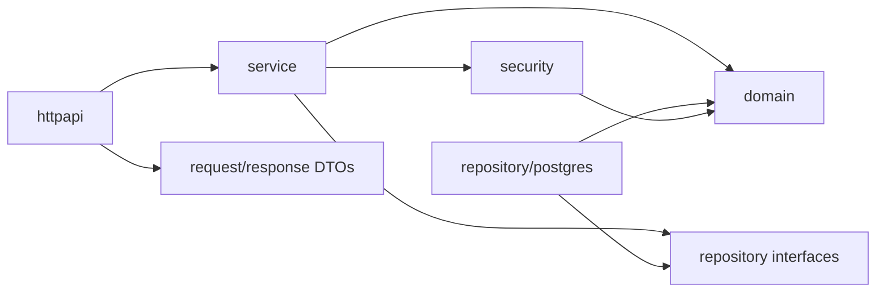
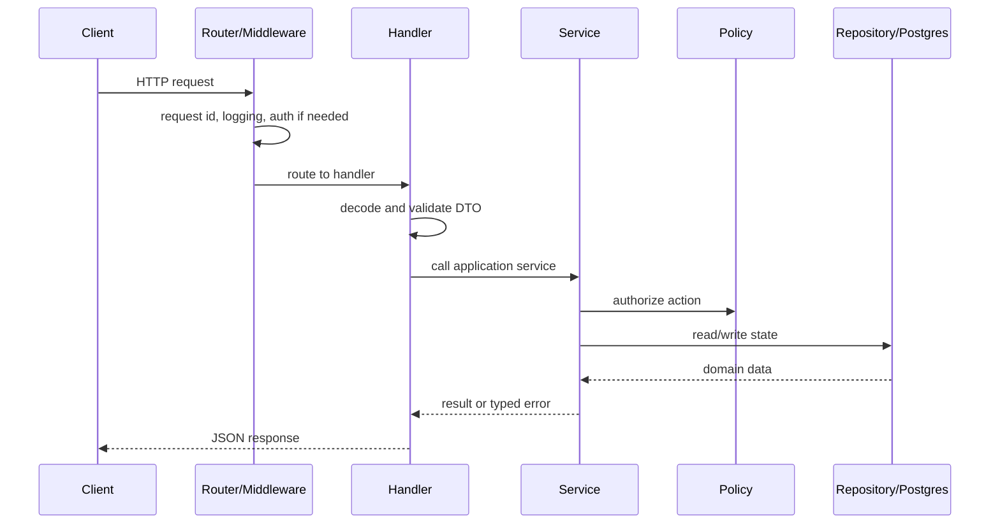

# Architecture

## Architectural Goal

Build a small but realistic backend service with clean boundaries, explicit dependencies, and testable business logic. Avoid over-engineering, but do not put all behavior directly in HTTP handlers.

## Proposed Runtime Architecture



## Suggested Go Package Layout

```text
.
|-- cmd
|   `-- api
|       `-- main.go
|-- internal
|   |-- app
|   |   `-- app.go
|   |-- config
|   |   `-- config.go
|   |-- httpapi
|   |   |-- router.go
|   |   |-- middleware.go
|   |   |-- handlers_auth.go
|   |   |-- handlers_orgs.go
|   |   |-- handlers_events.go
|   |   `-- errors.go
|   |-- domain
|   |   |-- users.go
|   |   |-- organizations.go
|   |   |-- events.go
|   |   `-- rsvps.go
|   |-- service
|   |   |-- auth_service.go
|   |   |-- org_service.go
|   |   |-- event_service.go
|   |   `-- rsvp_service.go
|   |-- repository
|   |   |-- interfaces.go
|   |   `-- postgres
|   |       `-- ...
|   |-- security
|   |   |-- password.go
|   |   `-- tokens.go
|   |-- observability
|   |   `-- logging.go
|   `-- validation
|       `-- validation.go
|-- migrations
|-- docs
|   `-- openapi.yaml
|-- test
|   `-- integration
|-- docker-compose.yml
|-- Makefile
|-- README.md
`-- AGENTS.md
```

## Dependency Direction



Rules:

- `domain` should not import HTTP or database packages.
- `service` coordinates business logic and authorization checks.
- `httpapi` translates HTTP requests to service calls and service errors to HTTP responses.
- `repository/postgres` handles SQL and persistence details.
- `security` handles password hashing and token operations.

## Request Lifecycle



## Error Handling

Use typed service errors and map them centrally to HTTP responses.

Suggested API error shape:

```json
{
  "error": {
    "code": "event_not_found",
    "message": "Event not found",
    "requestId": "req_123"
  }
}
```

## Configuration

All deployment-sensitive values should come from environment variables, with safe local defaults only for development.

Required eventual config:

- `APP_ENV`
- `HTTP_PORT`
- `DATABASE_URL`
- `JWT_ACCESS_SECRET`
- `JWT_REFRESH_SECRET` or refresh-token random generator config
- `ACCESS_TOKEN_TTL`
- `REFRESH_TOKEN_TTL`
- `CORS_ALLOWED_ORIGINS`
- `LOG_LEVEL`

## Why This Architecture Is Portfolio-Friendly

It is small enough to understand in one sitting but structured enough to show real engineering judgment. It avoids both extremes: a one-file demo and an overcomplicated enterprise skeleton.
