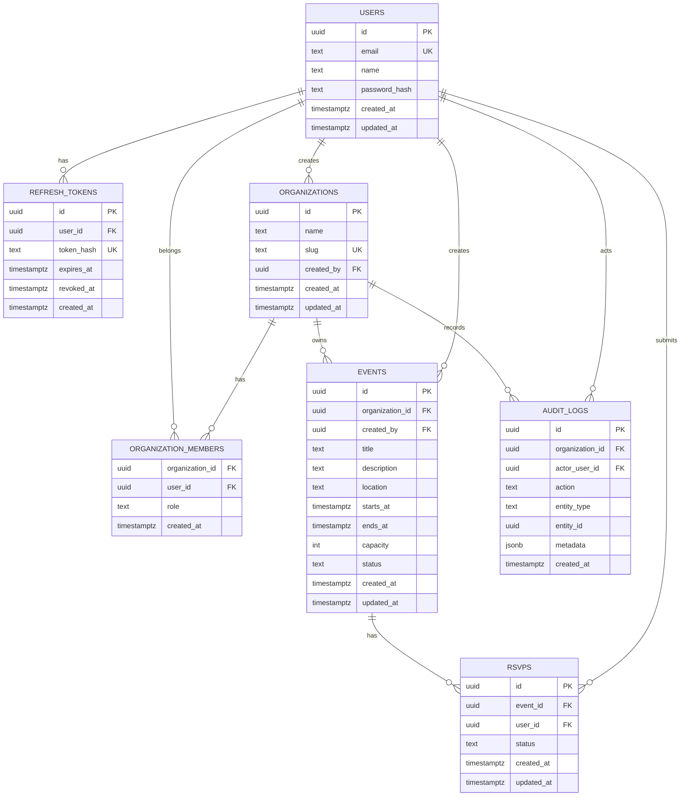

# Data Model

## Entity Relationship Diagram

## Key Constraints

### Users

- `email` must be unique.
- Store normalized lowercase email.
- Store password hash only.

### Refresh Tokens

- Store only token hash.
- Token hash must be unique.
- Revoked tokens must not be reusable.

### Organizations

- `slug` must be unique.
- Creator automatically becomes owner.

### Organization Members

- Composite uniqueness: `(organization_id, user_id)`.
- Role enum values: `owner`, `organizer`, `member`.
- Organization must always have at least one owner. MVP can enforce this in service logic.

### Events

- `status` values: `draft`, `published`, `cancelled`.
- `starts_at` must be before `ends_at`.
- `capacity` must be positive when present.
- Only published events appear in public listing.

### RSVPs

- Unique RSVP per `(event_id, user_id)`.
- Status values: `attending`, `waitlisted`, `declined`, `cancelled`.
- Capacity logic decides whether a new RSVP becomes attending or waitlisted.

### Audit Logs

- Append-only from application perspective.
- Include enough metadata to explain the change without storing secrets.

## Index Recommendations

- `users(email)` unique.
- `refresh_tokens(token_hash)` unique.
- `refresh_tokens(user_id)`.
- `organizations(slug)` unique.
- `organization_members(organization_id, user_id)` unique.
- `organization_members(user_id)`.
- `events(organization_id, starts_at)`.
- `events(status, starts_at)`.
- `rsvps(event_id, user_id)` unique.
- `rsvps(user_id)`.
- `audit_logs(organization_id, created_at desc)`.

## Migration Principles

- Every schema change is a migration.
- Migrations should be reversible when practical.
- Add constraints in the database, not only in Go code.
- Prefer explicit column lists in queries.
- Do not use `SELECT *` in production code.

## Implementation Status

The Phase 2 foundation implements this schema in `migrations/000001_create_core_schema.up.sql` with a reversible down migration. The migration includes the recommended foreign keys, unique constraints, role/status checks, timestamp columns, and indexes. Business rules that depend on application context, such as guaranteeing every organization always has at least one owner and enforcing RSVP capacity under concurrency, remain service-layer work for later phases.
