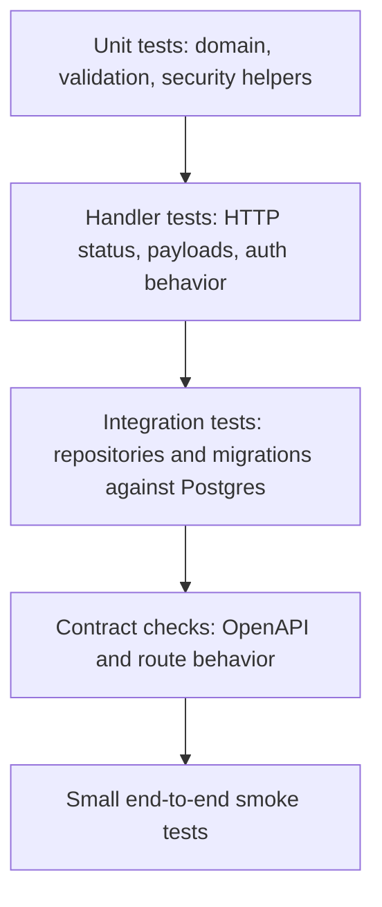

# Testing And Quality Strategy

## Testing Philosophy

Tests should prove business behavior, not only line coverage. The project should have enough tests that a reviewer trusts changes can be made safely.

## Test Pyramid



## Required Test Categories

### Unit Tests

- Password hashing and comparison.
- Token generation and validation.
- Domain validation helpers.
- Role/permission policies.
- RSVP capacity decision logic.

### Handler Tests

- Request decoding and validation failures.
- Auth-required routes return 401 when unauthenticated.
- Forbidden actions return 403.
- Not found cases return 404.
- Error envelope is consistent.

### Integration Tests

- Migrations apply successfully.
- Unique constraints work.
- Foreign keys work.
- Repository methods persist and read expected data.
- Transactional RSVP capacity behavior is correct.

### Contract Tests

- OpenAPI spec is valid.
- Documented endpoints exist.
- Core examples match actual responses.

## Minimum Quality Commands

The final implementation should support:

```bash
make test
make lint
make migrate-up
make run
```

If Make is not used, document direct commands in README.

## Coverage Expectations

Do not chase arbitrary coverage numbers. A reasonable portfolio bar:

- Critical auth/security logic: high coverage.
- Business services: high coverage.
- Handler error paths: meaningful coverage.
- Repository tests for every non-trivial query.

## CI Expectations

GitHub Actions should run:

- Go tests.
- Go vet.
- Formatting check.
- OpenAPI validation.
- Optional static analysis.

## Quality Lessons From The Old Project

The previous project compiled, but had no tests. It also had several bugs that tests would have caught:

- JWT expiration typo.
- Missing returns after error responses.
- Authorization branch that continued execution.
- Lack of database uniqueness constraint for attendees.

GatherOps should be built so those classes of issues are caught before review.
